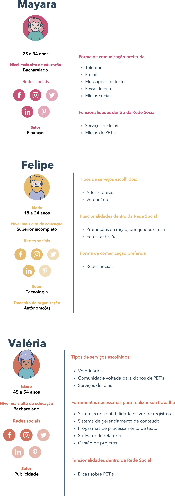
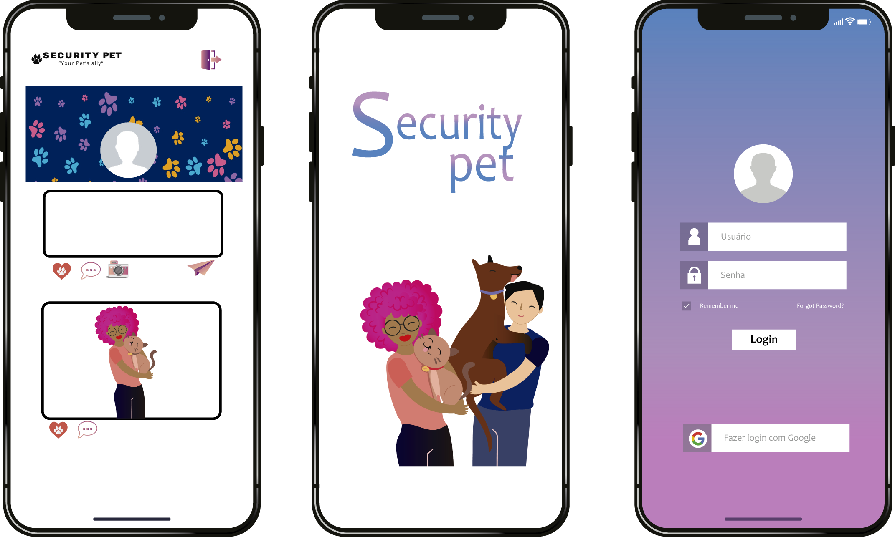

# Criando uma Rede Social

<b> *Acesse a aplicação [Aqui](https://rede-social-85909.web.app/) 

## Índice

- [1. Introdução](#1-introdução)
- [2. Resumo do projeto](#2-resumo-do-projeto)
- [3. Personas](#3-personas)
- [4. Funcionalidades](#4-funcionalidades)
- [5. Protótipos](#5-protótipos)
- [6. Aprendizado](#4-aprendizado)
- [. Desenvolvido por](#-desenvolvido-por)

---

## 1. Introdução

O objetivo desse projeto era desenvolver um SPA que permita visualizar, postar dados, e interagir.
A partir de histórias de usuárioa rede social deve fornecer funcionalidades que estejam de acordo com a necessidade do usuário. O projeto proposto pela Laboratória foi realizado em trio.

## 2. Resumo do projeto

Os amantes de pets geralmente ouvem a crítica "-Nossa mas você só posta foto de pets".
Pensando nessses usuários criamos a SECURITY PET, uma rede social totalmente voltada aos amantes de pets no geral.

Para o desenvolvimento da rede social fizemos uma pesquisa com usuários na faixa etária entre 18 e 54 anos.
Na SECURITY PET o usuário terá contato com profissionais da voltados a todo tipo de atendimento pet, e o contato com outros amantes e donos de pets, para compartilhar fotos e dicas sobre pets.

### 3. Personas

### 4.Funcionalidades
Novos usuários podem se cadastrar na rede através do cadastro do próprio site ou pelo login do Google;
Usuários já cadastrados podem acessar a plataforma através de email e senha ou pelo login do Google;
No feed de postagens é possível visualizar todas as postagens, tanto do usuário logado quanto de outros usuários, ordenadas das mais recentes às mais antigas. 
O usuário pode publicar texto, imagens e gifs em seus posts e também podem editar e deletar seus posts após publicado;
Os usuários podem dar like ou desfazê-lo, além de comentar um post.
No perfil o usuário pode editar a imagem do seu perfil.

### 5. Protótipos

### 6. Aprendizado
Aprendizado:
Manipulação da maior parte do layout da página em Flexbox - CSS
Uso de callbacks, consumo de Promises e uso de ES Modules - JS
Firebase Authentication, Firestore, onSnapshot, onAuthStateChanged e Firebase Hosting - Firebase
Colaboração por Git e GitHub.

Tecnologias Ultilizadas: 

* HTML5 semântico
* Conceitos fundamentais de CSS3
*  Mobile first
* VanillaJS / JavaScript (ES6+)
* Sistema de rotas / (SPA)
 * Trello
 Node.js
 Firebase

### .Desenvolvido por:
*[Tânagra Andria](https://github.com/TanagraAndria)
*[Sara Viana](https://github.com/SaraOhara)  
*[Stêfani Martins](https://github.com/martinstfn)
